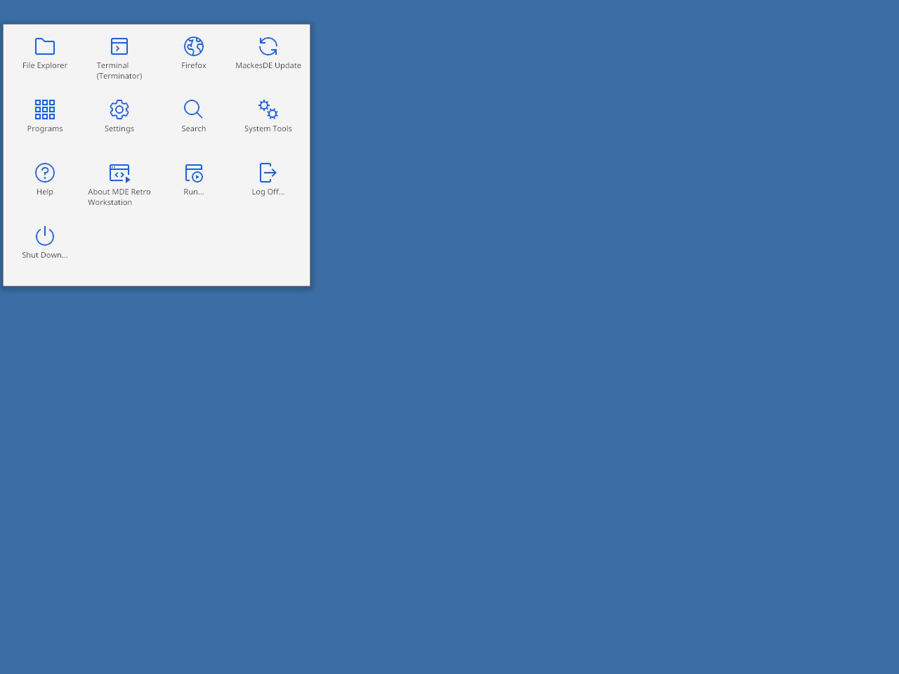

<div align="center">


# Mackes Workstation

**One cohesive IBM Carbon desktop, drawn natively in Rust — desktop and fleet platform in a single binary tree.**

[](https://www.gnu.org/licenses/gpl-3.0)
[](rust-toolchain.toml)
[](#)
[](#)
[](#)
[](#status)

</div>

---

## What is this?

**Mackes Workstation (MDE)** is a complete **desktop environment _and_ a fleet platform**
in one native‑Rust binary tree. The face is a full desktop — launcher, settings, action
center and notifications, task view, window snapping, a security dashboard, and a
mesh‑first file manager — drawn natively in Rust with the **IBM Carbon design system** as
its single, strict visual language. **No Electron, no GTK desktop, no web views.**

Underneath it runs a peer‑to‑peer **mesh platform**: a supervised daemon (`mackesd`), an
encrypted **Nebula** overlay, **LizardFS** mesh‑storage, native **KDE Connect**, voice/VoIP,
music, and an internal pub/sub **Bus** that ties the surfaces to the platform. For
everything that doesn't belong on the desktop, a Server‑console‑style **Workbench** drives
the fleet, compute, and mesh operations.

The whole desktop is **one multiplexed binary**: `mde <subcommand>` (`mde panel`,
`mde menu`, `mde settings`, `mde files`, `mde security`, `mde connect`, …) — each surface
is its own process, sharing one look library and talking to the platform over the Bus.

> **Guiding principle:** _Secure, Simple, No‑Fixed‑Center Workgroup._ Trust is mutual and
> decentralized — there is no privileged master node; every machine is a peer on the
> encrypted mesh.

<div align="center">

</div>

## Highlights

| | |
|---|---|
| **Carbon desktop shell** | A full native Rust/iced desktop on **labwc** — launcher, modern Settings, Action Center + notifications, Task View, Snap, Security dashboard, and a mesh‑first file manager — drawn strictly in **IBM Carbon** (flat, modern; switchable Gray 10 / 90 / 100 themes through one palette edge). |
| **Mesh platform underneath** | `mackesd` control plane · **Nebula** encrypted overlay · **LizardFS** mesh‑storage · an internal pub/sub **Bus** (no private D‑Bus) — an encrypted, no‑fixed‑center workgroup with shared storage across every peer. |
| **One install, three roles** | A single RPM with a deployment‑role chooser — **Lighthouse** (relay), **Server** (headless mesh), **Workstation** (full desktop), each a strict superset of the last. |
| **Pure‑Rust stack** | rustls (no OpenSSL), cosmic‑text (no FreeType), iced 0.13 (wgpu) + iced_layershell — one multiplexed `mde <subcommand>` binary, no Electron, no GTK desktop, no web views. |

## Architecture

The system is three tiers — the desktop surfaces on top, the services that back them in
the middle, and the mesh platform underneath — all in one workspace, all talking over the
Bus:

```
┌──────────────────────────────────────────────────────────────┐
│  SHELL       launcher · Settings · Action Center · Task View   │  crates/shell
│  (the face)  Snap · Security · file manager · Workbench        │  crates/workbench
│              native Rust/iced on labwc · strict IBM Carbon      │
├──────────────────────────────────────────────────────────────┤
│  SERVICES    files · clipboard · music/VoIP · notifications     │  crates/services
│  (support)   KDE Connect host · status applets                 │  crates/kdc, applets
├──────────────────────────────────────────────────────────────┤
│  PLATFORM    mackesd control plane · mde‑bus pub/sub backbone   │  crates/platform
│  (mesh)      Nebula encrypted overlay · LizardFS mesh‑storage   │  crates/mesh
└──────────────────────────────────────────────────────────────┘
```

**Compositor.** Mackes Workstation runs on **labwc** (Wayland/wlroots). labwc draws title
bars, frames, and z‑order; MDE draws only client areas and its own layer‑shell surfaces
(the panel, popovers, the launcher) — it is deliberately *not* a window manager. Window
control goes through `wlr-foreign-toplevel`.

**Theme.** Every color resolves through a single `palette::color()` edge that remaps to the
active Carbon gray theme before producing a pixel — so call sites never change when the
theme switches, and the entire surface restyles at once. Carbon's type scale, 8px spacing,
component metrics, motion, and 2px focus ring are single‑sourced and guarded by a lint gate.

### The desktop

The shell ships a complete desktop, flat and modern in IBM Carbon throughout: an app
launcher, a modern **Settings** app, an **Action Center** with live notifications, **Task
View** and window **Snap**, a **Security** dashboard, lock/login surfaces, and a
**mesh‑first file manager** that browses local, LizardFS, and peer locations from one place.

### Mesh & security

The mesh gives you an **encrypted overlay** (Nebula) and **shared storage** (LizardFS)
across a workgroup with **no fixed center** — every node is a peer, trust is mutual, and
there's no privileged master to lose. Pairing is **mutual‑TLS**; the encrypted Nebula
overlay carries all inter‑node traffic; the on‑desktop **Security** dashboard surfaces the
posture. The control plane (`mackesd`) owns the workers, mesh, and CA state; surfaces and
the Workbench consume that state and send actions over the **Bus**.

### Bundled services

- **KDE Connect** — a native, pure‑Rust host (`crates/kdc`) with mutual‑TLS pairing and a
  bidirectional listener; paired phones surface both as devices and as browsable mesh
  locations in the file manager.
- **Voice / VoIP** — voice services with an on‑screen HUD and configuration surface.
- **Music** — a music daemon and player.
- **Clipboard & notifications** — a clipboard daemon (history) and the Action‑Center
  notification service.
- **Status applets** — a set of tray applets (clock, audio, notifications, launcher…).

### Workbench

The **Workbench** is the fleet/operations console — the place for everything that doesn't
fit the desktop idiom. It manages the fleet, **compute** (KVM virtual machines and Podman
containers — creation wizard, templates, console, migration), mesh operations, maintenance,
and deployment roles, wearing the platform's own Carbon theme.

## Repository layout

```
crates/
  platform/    mde-bus (pub/sub backbone), mde-role (deployment roles)
  mesh/        mackesd (control plane), Nebula tunnel, mesh types/config/transport
  shell/       mde (the multiplexed shell binary), mde-ui (look library / widgets),
               installer, session, wizard, popover, peer-card, …
  workbench/   mde-workbench (fleet · compute · mesh-ops console)
  services/    mde-files, mde-clipd, mde-music{,d}, mde-voice-{config,hud}
  shared/      mde-theme / mackes-theme, mde-iced-components, mde-card, mde-disclaimer
  applets/     status applets (clock, audio, notifications, start-menu) + applet-api
  kdc/         mde-kdc-proto, mde-kdc-host (canonical KDE Connect host)
  legacy/      retiring crates (kept for reference)
assets/  data/  skel/  packaging/  docs/
```

## Build

The toolchain is pinned by `rust-toolchain.toml` (Rust **1.94**). The audio chain links
ALSA, so a full build needs the system dev libraries first (Fedora):

```sh
sudo dnf install -y gtk3-devel alsa-lib-devel

cargo check --workspace        # green over the whole tree (no crates excluded)
cargo build --workspace
cargo test                     # unit + accuracy tests
cargo clippy --all-targets     # lint — warnings are treated as work
cargo fmt --all
```

Run a surface directly from the built binary:

```sh
./target/debug/mde panel        # the top Carbon bar
./target/debug/mde menu         # the launcher
./target/debug/mde settings     # the modern Settings app
```

<div align="center">

</div>

## Contributing

A few load‑bearing conventions (see [`CLAUDE.md`](CLAUDE.md) for the full rulebook):

- **No raw hex outside the palette.** Every color is a Carbon token through
  `palette::color()` — the one theme‑remap edge.
- **Carbon tokens are single‑sourced.** Type scale, 8px spacing, component metrics, and
  motion live in the token modules; a **lint gate** fails the build on raw values outside
  them, and pinning tests assert the token set.
- **No stubs.** A change is "done" only when it's reachable from a runtime entry point and
  observably works — no `todo!()`, no mock data standing in for real behavior.
- **A green `cargo test` does not verify a render.** Visual changes are confirmed against
  the reference with the preview/accuracy harness.

## Status

Active development — **pre‑release**. The current target is **M1: a usable desktop** — the
Carbon shell, its core surfaces, and the mesh platform working end to end. The single‑RPM,
role‑chooser release is held until every feature is complete (no stubs), with hardware
bench validation after that. Expect churn until then.

The platform identity and architectural locks (mesh, Bus, storage, security, naming) live
in [`docs/AI_GOVERNANCE.md`](docs/AI_GOVERNANCE.md).

<div align="center"></div>

## License & Disclaimer

**GPL‑3.0‑or‑later.** Original assets and design. The visual language follows the
**[IBM Carbon Design System](https://carbondesignsystem.com)**; this project is not
affiliated with or endorsed by IBM.

> ⚠️ **Experimental / educational software.** Provided with **no warranty**; you accept
> full risk. See **[`DISCLAIMER.md`](DISCLAIMER.md)** for the full warning, disclaimer,
> and mission statement.
