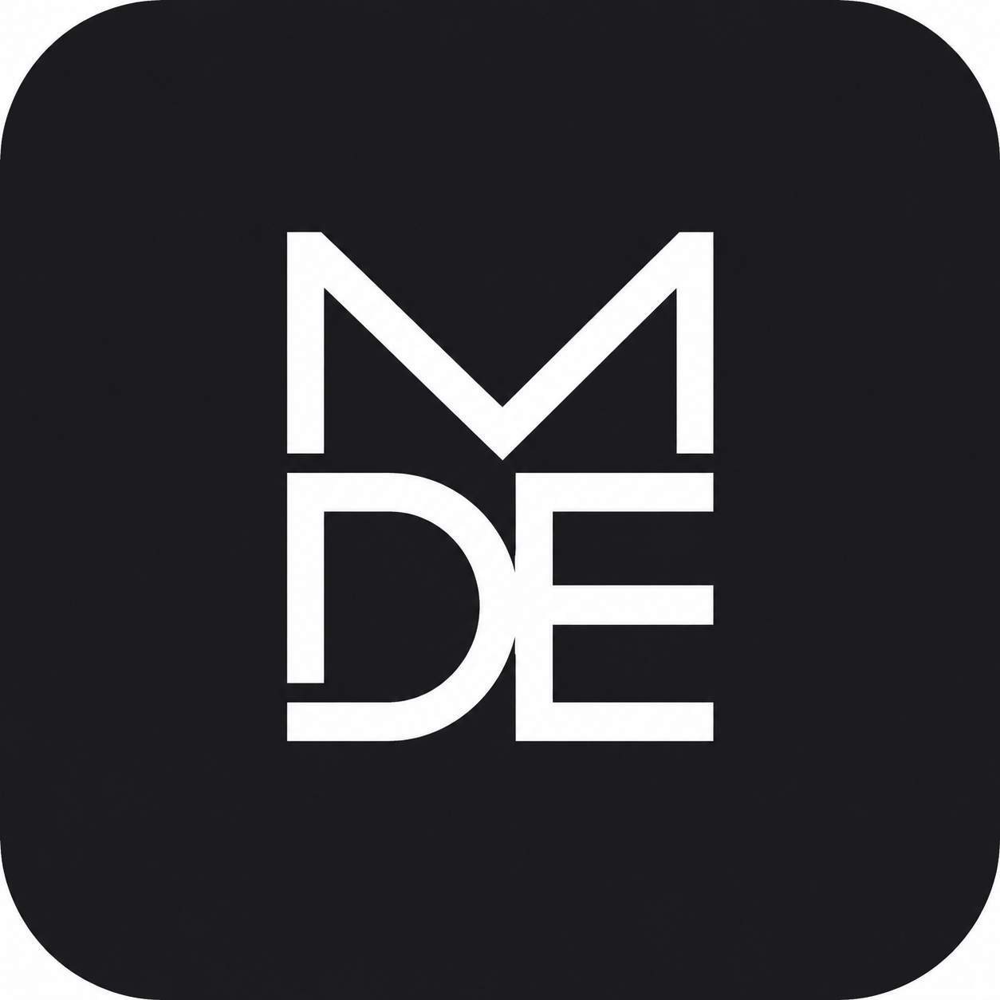
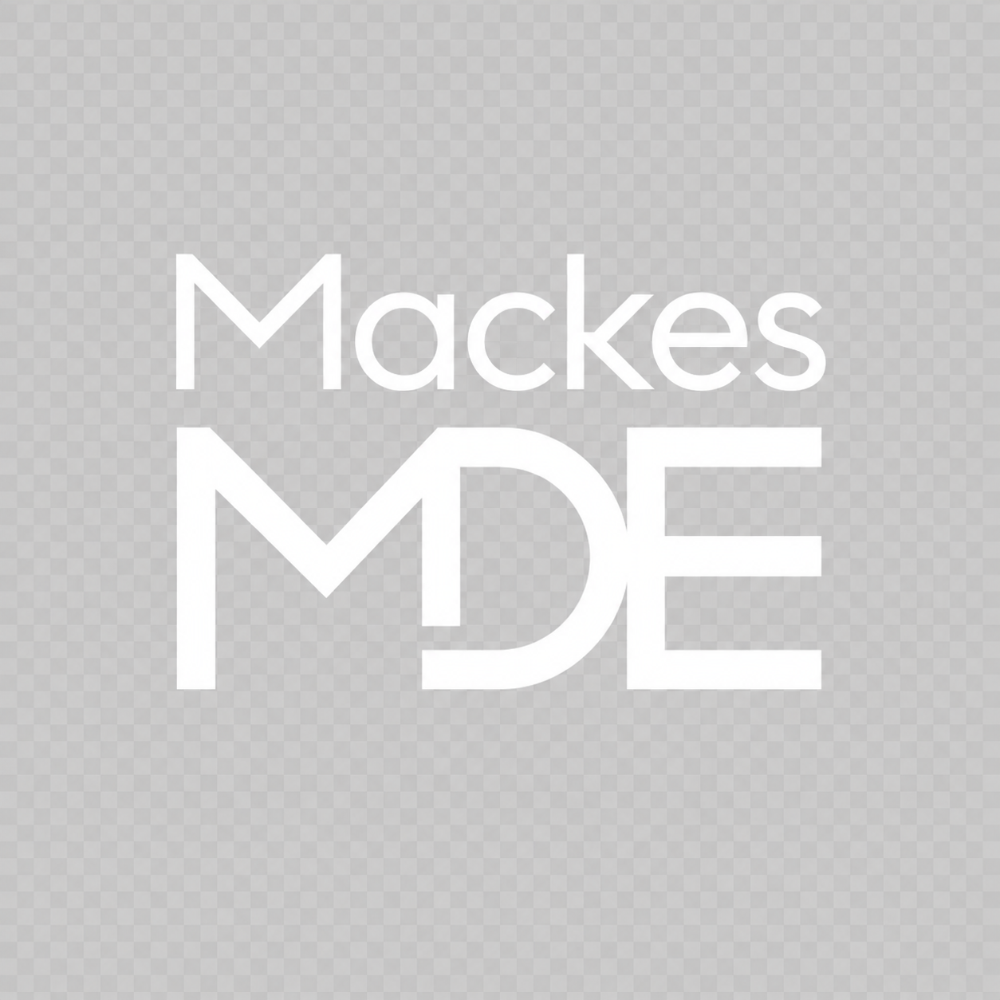

<div align="center">



# Mackes Workstation

**A Windows‑10‑style desktop, riding on a Rust mesh platform.**

The successor that fuses **MDE** *(MackesDE for Workgroups)* and **MDE‑Retro**
into a single, native‑Rust operating environment — one shell, one mesh, one repo.

[](LICENSE)
[](rust-toolchain.toml)
[](#)
[](docs/MACKES-WORKSTATION-PLAN.md)
[](MIGRATION.md)

</div>

---

## What is this?

Mackes Workstation is a desktop **environment _and_ a fleet platform** in one binary
tree. The face is a faithful **Windows 10** shell (Start, Settings, Action Center,
Explorer, Your Phone, Security…) drawn natively in Rust — **no Electron, no GTK
desktop, no web views**. Underneath it runs a peer‑to‑peer **mesh platform**: a
supervised daemon (`mackesd`), an encrypted **Nebula** overlay, **LizardFS**
mesh‑storage, native **KDE Connect**, voice/VoIP, music, and a Server‑2003‑style
**Workbench** admin console for everything that doesn't fit the Windows 10 idiom.

It's the **successor** to two earlier projects — it absorbs both (with their full
history) and end‑of‑lifes them. *Reuse is the whole point.*

> Four switchable looks share one theme engine: **Windows 2000 Classic**,
> **IBM Carbon** (the default dark theme), **Windows 10**, and **BeOS** — flipped at a
> single `palette::color()` edge, so every surface restyles at once.

## Highlights

| | |
|---|---|
| 🪟 **Native Win10 shell** | Tiled Start, modern Settings, Action Center + notifications, Task View, Snap, Explorer, Security dashboard — all in Rust/iced on **labwc** |
| 🕸️ **Mesh underneath** | `mackesd` control plane · Nebula encrypted overlay · LizardFS mesh‑storage · an internal pub/sub **Bus** (no private D‑Bus) |
| 📱 **Native KDE Connect** | Pure‑Rust host (`crates/kdc`) with mutual‑TLS pairing + a bidirectional listener — phones appear as devices and as cloud locations in Explorer |
| 🛠️ **Workbench** | A "Manage Your Server"‑style console for fleet, compute (KVM/Podman), mesh ops, maintenance & roles — wearing the platform's own theme |
| 🎚️ **One install, three roles** | A single RPM with a deployment‑role chooser — **Lighthouse** (relay), **Server** (headless mesh), **Workstation** (full desktop) |
| 🔒 **Pure‑Rust stack** | rustls (no OpenSSL), cosmic‑text (no FreeType), one multiplexed `mde <subcommand>` binary |

## Architecture

```
┌──────────────────────────────────────────────────────────────┐
│  SHELL        Windows‑10 surfaces  ·  Workbench  ·  apps       │  crates/shell, workbench, services
│  (the face)   native Rust/iced on labwc · one theme engine     │
├──────────────────────────────────────────────────────────────┤
│  PLATFORM     mackesd · mde‑bus · KDE Connect · voice · music   │  crates/platform, mesh, kdc
│  (underneath) Nebula mesh · LizardFS mesh‑storage              │
└──────────────────────────────────────────────────────────────┘
```

## Repository layout

```
crates/
  platform/    mde-bus (mesh pub/sub backbone)
  mesh/        mackesd (control plane), Nebula tunnel, mesh types/config/transport
  shell/       mde (the multiplexed shell binary), mde-ui (widget kit), installer, …
  workbench/   mde-workbench, mde-virtual (compute)
  services/    files, clipboard, music, voice daemons
  shared/      theme, iced components, cards
  applets/     17 status applets
  kdc/         mde-kdc-proto, mde-kdc-host (canonical KDE Connect host)
  legacy/      retiring crates (kept for reference)
assets/  data/  skel/  packaging/  docs/  provenance/
```

The full design — decisions, the per‑crate reuse table, the epic roadmap (E0–E8) and
the deployment‑role architecture — lives in
**[`docs/MACKES-WORKSTATION-PLAN.md`](docs/MACKES-WORKSTATION-PLAN.md)**.

## Build

```sh
# the toolchain is pinned (rust-toolchain.toml → 1.94)
# the audio chain links ALSA, so install the system dev libs first (Fedora):
sudo dnf install -y gtk3-devel alsa-lib-devel

cargo build --workspace        # or: cargo check --workspace
```

`cargo check --workspace` is green over the whole tree (no crates excluded since E0.2;
`.cargo/config.toml` carries a CMake-4 fix for the vendored Opus). See
[`MIGRATION.md`](MIGRATION.md).

## Status

**E0 — the merge — is complete:** three repos fused into this monorepo with full history
(1,635 commits), reorganized to the layout above, building green. What's ahead, per the
plan: **E1** deployment‑role install · **E2** KDE Connect convergence · **E3** LizardFS
mesh‑storage · **E4** Win10 shell replaces the old portal · **E5** apps · **E6** Workbench
re‑skin · **E7** merged first‑run/OOBE · **E8** polish + the v10.0.0 release.

## Heritage

This repo is the union of three now‑archived projects, each preserved in its history:

- **MDE** — *MackesDE for Workgroups*, the Rust mesh platform
- **MDE‑Retro** — the Windows‑10 / IBM‑Carbon shell
- **MDE‑KDECnt‑Rust** — the native KDE Connect host

<div align="center"></div>

## License & Disclaimer

**GPL‑3.0‑or‑later.** Original assets; Windows‑10‑*inspired*, not a clone.

> ⚠️ **Experimental / educational software.** Provided with **no warranty**; you accept
> full risk. See **[`DISCLAIMER.md`](DISCLAIMER.md)** for the full warning, disclaimer,
> and mission statement.
